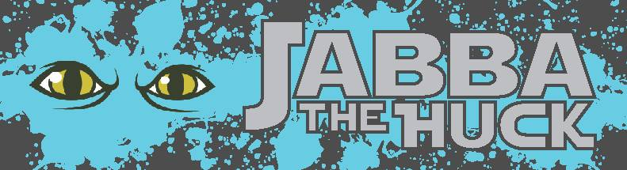
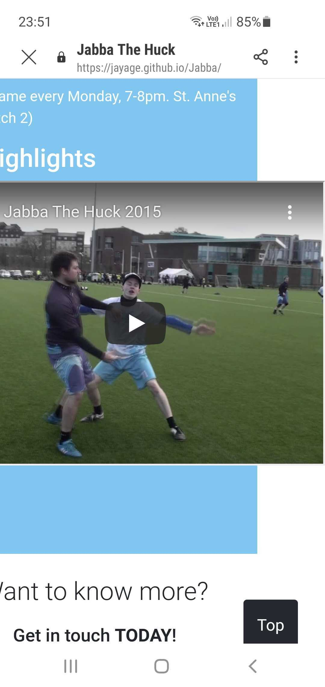

# Jabba The Huck

## Table Of Contents
- [Project Overview](#project-overview)
- [UX](#ux)
  - [User Stories](#user-stories)
  - [Strategy](#1-strategy)
  - [Scope](#2-scope)
  - [Structure](#3-structure)
  - [Skeleton](#4-skeleton)
  - [Surface](#5-surface)
- [Features](#features)
  - [Existing Features](#existing-features)
- [Technologies Used](#technologies-used)
  - [Languages](#1-languages)
  - [Workspace, Version Control, and Repository Storage](#2-workspace-version-control-and-repository-storage)
- [Resources](#resources)
- [Testing](#testing)
- [Deployment](#deployment)
- [Credits](#credits)
  - [Code](#code)
- [Acknowledgments](#acknowledgments)

## Project Overview
Jabba The Huck Mixed Ultimate Frisbee Club.
Ireland's longest running and most successful ultimate club is back in 2021 for a full season of mixed ultimate.

A link to the live website can be found [here](https://jayage.github.io/Jabba/)

## UX
### User Stories

- As a user I want to, find out more about the club.
- As a user I want to, be able to view the website on various devices (mobile, tablet, desktop)
- As a user I want to, find out who to contact with any queries regarding the club.
- As a user I want to, find out more about the leadership of the club.

### 1. Strategy

- Create a website that showcases the Ultimate Frisbee club team, Jabba the Huck
- Create an enjoyable and easy to use website.

### 2. Scope

- Fits in with my current skill-set of HTML & CSS
- Easy to 

### 3. Structure

As the website was built on being a single page with multiple sections. The nav bar when any option is selected will scroll down to the relevant part of the website. 
While the user doesn't have to scroll back to the top each time they want to see the top of the page thanks to a back to the top button that was implemented.

### 4. Skeleton

- Desktop wireframe can be found [here](assets/documents/desktopwireframe.png) 
- Tablet wireframe can be found [here](assets/documents/tabletwireframe.png) 
- Mobile wireframe can be found [here](assets/documents/mobilewireframe.png) 

### 5. Surface
The overall UX is clean and similar in all pages to keep consistency.

### Colors:
The base color **vivid Sky Blue(#66C7F4)** was chosen from [Coolors](https://coolors.co/). Some different colour tones were 
also chosen to make the website more elegant.

## Features

### Existing Features

- Designed with HTML5, CSS3, JavaScript, Python3, Flask, MongoDB and Materalize.
- Responsive navigation bar, YouTube embed  and contact form.
- Footer with social media links.

## Technologies Used

### 1. Languages

- [HTML5](https://en.wikipedia.org/wiki/HTML5)
- [CSS](https://en.wikipedia.org/wiki/CSS)
- [JavaScript](https://en.wikipedia.org/wiki/JavaScript)

### 2. Workspace, version control, and repository storage

- [Gitpod](https://www.gitpod.io/) - IDE (Integrated Development Environment) used to write the code.
- [GitHub](https://github.com/) - Repository hosting service to host the deployed website and track previous versions of code.

## Resources

- [W3.CSS](https://www.w3schools.com/w3css/defaulT.asp) - General resource.
- [Youtube](https://www.youtube.com/) - General resource.
- [Coolors](https://coolors.co/) - Find matching color palette for site.
- [Balsamiq](https://balsamiq.com/wireframes/) - Wireframing design tool.
- [Google Mobile-Friendly](https://search.google.com/test/mobile-friendly) - Test Mobile-friendly check on site.
- Code Institute SLACK Community - General Resource

## Code Validation

- [W3C HTML](https://validator.w3.org/) - HTML Markup Validation.
- [W3C CSS](https://jigsaw.w3.org/css-validator/) - CSS Validation.

## Testing
Testing was done through peer support. By letting testers through the slack community, some bugs were found.

## Deployment
### This project has been deployed on GitHub Pages with the following process:

- All code was written on Gitpod, an online IDE.
- The code was then pushed to GitHub where it is stored in my [Repository](https://github.com/Jayage/Jabba).
- Under the settings section of the GitHub repository, scrolled down to GitHub Pages section.
- Under 'Source' drop-down, the 'Master branch' was selected.
- Once selected, this publishes the project to GitHub Pages and displays the site url.
- There is no difference between the deployed version and the development version.
- The code can be run locally through clone or download.
- You can do this by opening the repository, clicking on the green 'Code' button and selecting either 'clone or download'.
- The Clone option provides a url, which you can use on your desktop IDE.
- The Download ZIP option provides a link to download a ZIP file which can be unzipped on your local machine.

## Credits
### Code

- Back to the top button can be found [here](https://www.w3schools.com/howto/howto_js_scroll_to_top.asp)

## Acknowledgments
- Thanks for my mentor, Excellence Ilesanm for guidence and excellent advices.
- Thanks to all Code Institute staff.
- Thanks to CI Slack Community for all the assistance and support.
